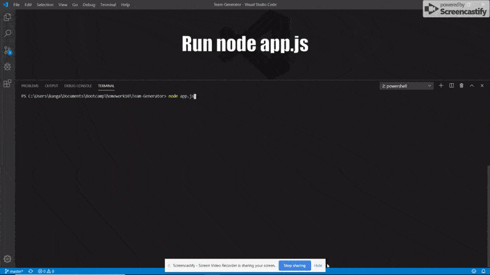
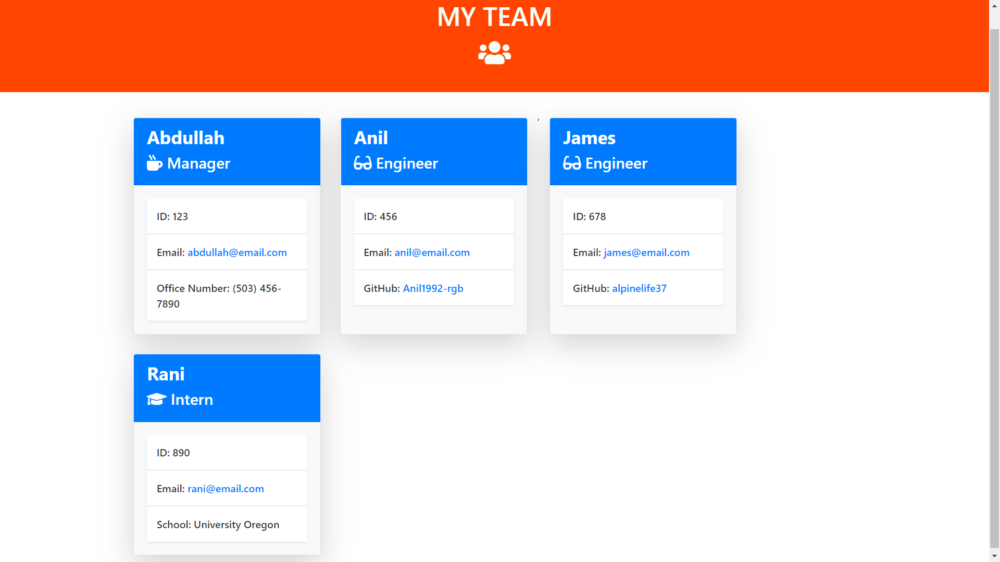

# Team-Generator (Software-Engineering based)
___________________________________________________________________________________________________________________________________________
___________________________________________________________________________________________________________________________________________

**Description

- Node CL application that takes in information about employees and generates an HTML webpage that displays summaries for each person.

____________________________________________________________________________________________________________________________________

**Instructions

You will be prompted to enter information about a team of employees. You can choose as many employees and any mix of employee type for your team. Once your done the application will generate an html document that will neatly display a roster of your team.

____________________________________________________________________________________________________________________________________

