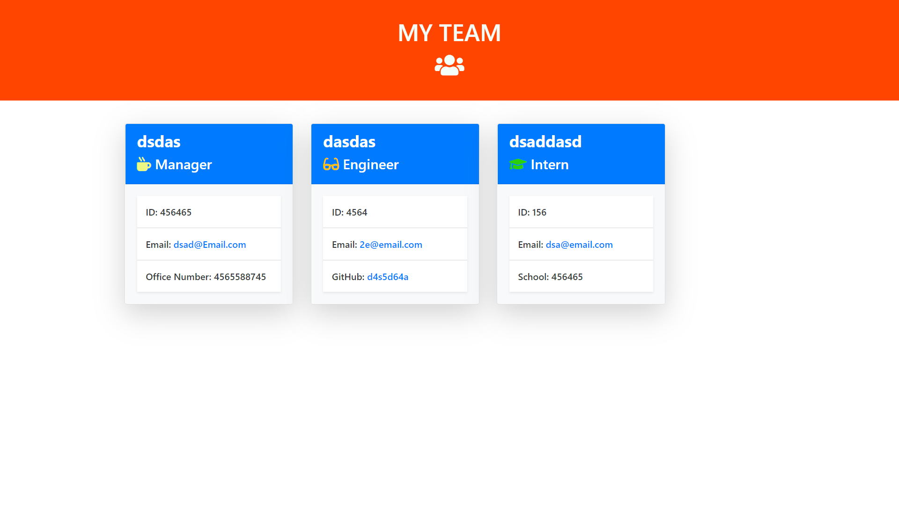

# Team-Generator (Software-Engineering based)
___________________________________________________________________________________________________________________________________________
___________________________________________________________________________________________________________________________________________

**Description

- Node CL application that takes in information about employees and generates an HTML webpage that displays summaries for each person.

- the app will take in one manager for the team and require you to at least add one more employee before you can generate an html.

- You can add either Engineers or interns and can add as many as you like.

- The team will generate in the order of manager, engineers, interns

- The team file will be generated in the output folder of the repo

____________________________________________________________________________________________________________________________________

**Instructions

- fork and clone the repo
- run npm install
- run node app.js
____________________________________________________________________________________________________________________________________

**GIF Demo**
____________________________________________________________________________________________________________________________________

____________________________________________________________________________________________________________________________________

**Example picture of output file**
____________________________________________________________________________________________________________________________________

____________________________________________________________________________________________________________________________________
